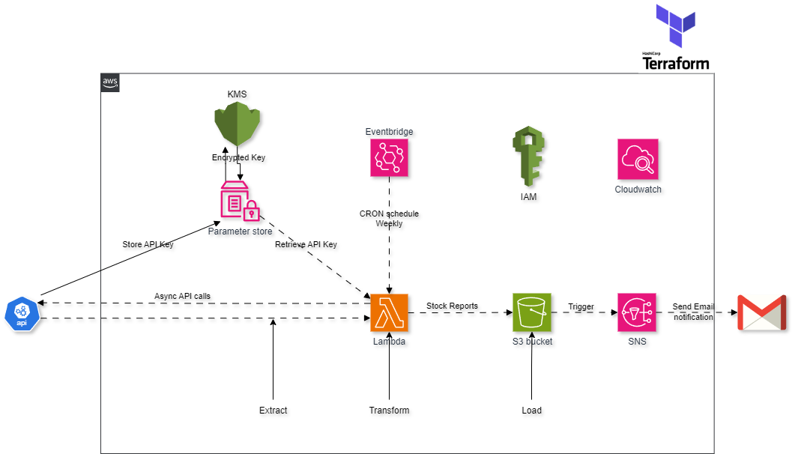

# AWS ETL Architecture

---

* **Data Collection:** REST API \
* **Scripting Language:** Python \
* **Infrastructure:** Terraform for provisioning and maintenance

___

🌐 AWS Stack:

* **Parameter Store:** Secure storage for API keys with KMS encryption
* **EventBridge:** Scheduling CRON jobs to trigger Lambda functions
* **Lambda:** Asynchronous API calls and data transformation into reports
* **S3:** Storing the generated reports
* **SNS:** Email notifications for report delivery
* **CloudWatch:** Comprehensive monitoring
* **IAM:** Managing roles and policies