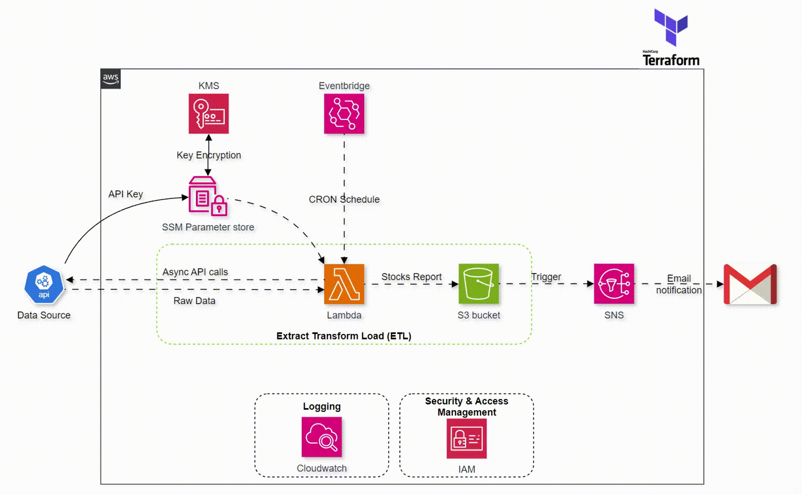

# AWS ETL Architecture

---

* **Data Collection:** Asynchronous REST API calls
* **Scripting Language:** Python
* **Infrastructure provisioning and maintenance:** Terraform

___

🌐 AWS Stack:

* **Parameter Store:** Secure storage for API keys with KMS encryption
* **EventBridge:** Scheduling CRON jobs to trigger Lambda functions
* **Lambda:** Run Python Script for Data Ectraction and transformation
* **S3:** Storing the generated reports
* **SNS:** Email notifications for new reports
* **CloudWatch:** Comprehensive monitoring
* **IAM:** Managing roles and policies
